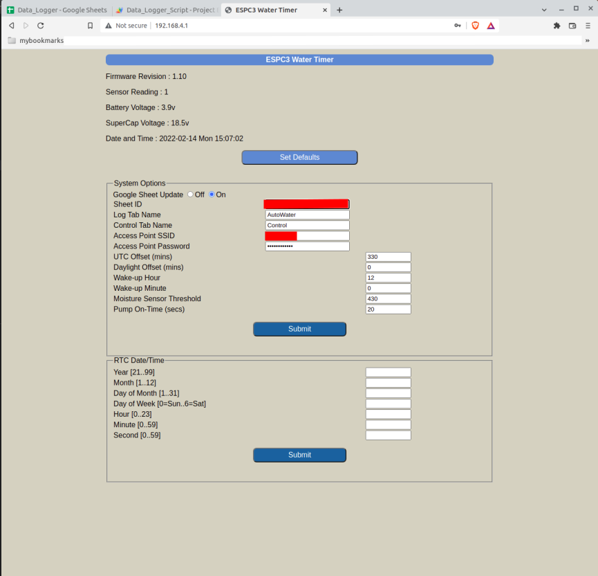

# ESP32C3_AUTO_WATER

An ESP32-C3 module together with a capacitive soil moisture sensor and DS3231 Real-time Clock (RTC) is used to automatically water a plant bed using a pump placed in a water storage container. 

Power for the pump comes from a bank of super-capacitors charged by a solar panel. 

Power for the electronics comes from a LiPoly battery (or 4 x 1.5V AA cells).

The system is self-contained. No mains power supply or connection to a water faucet is required.

In normal watering mode, the ESP32-C3 is woken up from deep-sleep once a day at a scheduled time by the DS3231 RTC. It checks the soil moisture level and if required, turns on the water pump. 

It then optionally logs the calendar date and time, moisture sensor reading, power supply voltages, watering duration, RTC clock drift (compared to NTP time) as a row of entries in a Google Docs spreadsheet document. 

If the Google Sheet upload option is enabled and the configured Internet Access Point is not available, this data set is queued to a buffer in ESP32-C3 flash memory. 

If internet access is available, any queued records in flash are removed from the queue and uploaded to the spreadsheet, before the current day's data record. 

Up to 30 data records can be queued in ESP32 flash. After 30 days, the oldest queued record will be over-written by the current day's data record.

 
 

## Configuration
To configure the watering system, press the reset button for the ESP32-C3 module and then immediately press the configuration button (GPIO9) when you hear a pulsing tone. Keep it pressed until you hear a long confirmation tone, and then release. The system is now configured as a stand-alone WiFi Access Point (AP) with SSID `ESPC3WaterTimer` and password `123456789`.

A web server running on this AP at `url : http://192.168.4.1` can then be used to configure the following :
* System Options
  * Enable / disable data uploads to the Google Docs spreadsheet
  * Google Sheet URL ID
  * Google Sheet Tab name
  * Internet Access Point SSID 
  * Internet Access Point password
  * Local Time Zone UTC offset
  * Local Daylight Savings offset
  * Daily wake-up time
  * Soil moisture threshold for watering
  * Pump on-time
* Real-Time Clock
  * Date
  * Time

Note that the RTC configuration is useful for initial setting. If Google Sheet update is enabled and
internet access is available, the system will get the local time from a Network Time Protocol (NTP) server 
and correct the RTC if required.  The error in seconds (NTP time minus RTC time) is also logged to the spreadsheet.

Click on the `Submit` button after making changes to the options.

When you are done with configuration, press the hardware reset button on the ESP32 module. The system will now be
in normal watering mode.

 
 

## OTA Firmware Updates
You can update the firmware via this configuration server. Enter the url `http://192.168.4.1/update`. Choose the
new firmware binary file.  After the file is uploaded, the ESP32-C3 module will automatically re-start with the updated firmware. Check the new firmware revison string in the configuration server home page (assuming the revision string has been updated along with code changes).

 
 

# Execution log and current draw

 
The sensor was disconnected for this run : "Sensor reading  0". 

When

* Google Sheet update is enabled
* Internet access is available
* Watering is not required
* No queued unsent records

the total time each day not in deep-sleep mode is < 15 seconds. This includes time spent to get local time from an NTP server and check against RTC time.

If watering is required, an additional 20 seconds assuming the default pump on-time of 20 seconds. 

Note that Google Sheets returns a redirect HTTP code (302), so this is the expected value.

The current drawn from a Li-Ion battery was monitored by an external INA219 current meter, gated by a gpio signal (pin 18) from the ESP32. This gpio pin is set to 1 on boot and reset to 0 just before entering deep-sleep. The meter samples the current at ~1.1kHz while the gate is high. 

The average circuit current drain from the battery from entering `setup()` to entering deep-sleep mode is ~46mA, with peaks of ~300mA (during wifi transmission bursts). 

In deep-sleep mode, the total circuit current drain is ~15uA. 

# Build Environment
* Ubuntu 20.04 LTS AMDx64
* Visual Studio Code with PlatformIO plugin using Arduino framework targeting `esp32dev` board. The file `platformio.ini` specifies the framework packages and toolchain required by the ESP32-C3 module, and libraries used by the project.
* Custom `partition.csv` file with two 1.9MB code partitions supporting OTA firmware update
* ~160kByte LittleFS partition for hosting HTML web server pages

# Hardware 
## [Circuit Schematic](docs/espc3_autowater_schematic.pdf)

## Power supplies

* 20V Solar Panel 
It may not be sunny enough to run the pump directly off the solar panel when the ESP32-C3 wakes up at the scheduled time.
So the solar panel is used to charge up a bank of super-capacitors connected in series. 
This bank is used to power the 12V water pump.

* Super-capacitor bank 
I used eight 10F 2.7V super-capacitors in series to provide an energy storage bank to power the 12V water pump. 
Even on a moderately cloudy day, the capacitor bank charges up to ~18V. 
I used a series 1N4007 diode from the solar panel so that the capacitor bank does not discharge back through the panel. Once charged to 17V+, the super-capacitor bank can run the 12V water pump for at least 30 seconds.

* Li-ion Battery 
This is used to provide circuit power via an HT7333 LDO 3.3V regulator. 

## DS3231 Real-Time Clock 
This provides a daily alarm at the scheduled time to wake up the ESP32-C3 from deep sleep.

### Minimizing DS3231 Current Drain

#### Option 1
The DS3231 VCC pin is connected to the 3.3V circuit supply, and an external CR2032 coin cell is connected to the VBAT pin providing backup. The RTC drains < 100uA as per the datasheet. I measured ~110uA total circuit current drain in deep-sleep mode. The bulk of the deep-sleep circuit current drain is from the RTC.
    
#### Option 2
The DS3231 datsheet gives us a useful option : leave the DS3231 VCC pin un-connected and power the VBAT pin with the circuit 3.3V supply. The RTC SCL, SDA and INT_ pins are now pulled up via resistors to the VBAT pin. In this case, the RTC time-keeping operation works as before but with much less current drain. I measured ~15uA total circuit drain in deep-sleep mode. 
    
There are a couple of caveats with this option : 
1. It takes a couple of seconds for the oscillator to start up the first time power is applied to VBAT
2. If you disconnect the battery, there is no backup so the RTC loses all date/time information. This is not an issue if Google Sheet updates are enabled. When the ESP32-C3 connects to the internet, it updates the RTC with date & time from an Network Time Protocol (NTP) server.  
If Google Sheet updates are disabled, we can manually set the RTC date/time via the WiFi configuration web page. 

### ESP32-C3 Wake-up Reset Pulse
A 4.7uF capacitor in series between the DS3231 INT_ output pin and the ESP32-C3 EN pin generates a reset pulse for the ESP32-C3 at the daily scheduled time.

For the ESP32-C3 EN pin, I used a 2K2 resistor pullup to VCC and a 1uF ceramic cap to ground. 

## Capacitive Soil Moisture Sensor

[Ensure you have a capacitive sensor module that actually works!](https://www.youtube.com/watch?v=IGP38bz-K48) The version I have uses a 555 timer IC marked "NE555 20M". 

I sealed the electronics back-end of the sensor board with silicone caulk and a heatshrink tube to prevent any corrosion of the electronics. 

It is possible for the top soil layer to dry out while the roots are still in damp soil. So the sensor is placed horizontally, half-way down the side of the plant pot. 

A 1-meter shielded cable provides ground, power supply and analog sensor output interface. The analog sensor output voltage increases as the soil gets drier.

This particular sensor module has a current draw of ~6mA.  It has an on-board voltage regulator and is powered from the battery via a mosfet power switch circuit  controlled by an ESP32-C3 GPIO pin. After reading the sensor, the sensor power supply is switched off. This is necessary to minimize total circuit current draw during ESP32-C3 deep-sleep mode.

## Power Mosfet Switch Module

I used this switch module to control the water pump. The PWM input is connected to an ESP32-C3 GPIO pin for simple on-off control. 

The super-capacitor power bank provides the DC power supply for the water pump. 

I used an FR303 diode as flyback protection for the inductive pump motor load.

## Minimizing Circuit Current Drain

The eventual project goal is to use a primary battery (or a rechargeable battery with low self-discharge rate), without needing to replace or recharge it for a few months at least. 

I used a Holtek HT7333 voltage regulator because it draws very little quiescent current (~4uA) and has
a low dropout voltage of 100mV-150mV.

The ESP32-C3 is clocked at the minimum clock frequency that gives us WiFi capability (80MHz).

The capacitive moisture sensor draws ~6mA but the power supply to the sensor is switched off after the reading is taken. 

The ADC resistor drop for measuring battery voltage is taken from the switched power supply for the moisture sensor, so there is no resistive drain path in deep-sleep mode.

In deep-sleep mode, the components drawing current from the battery are :
* ESP32-C3 deep-sleep current
* HT7333 regulator quiescent current
* DS3231 RTC (minimized current drain by using VBAT as power supply with VCC pin unconnected - see above)

We can estimate battery capacity drain over the course of a day : 
1. Active mode : ~50mA x ~20 seconds = 50mA x (20/3600)Hr = 0.28mAHr
2. Deep-sleep mode : ~15uA x ~24 hours = 0.015mA x 24Hr = 0.36mAHr

So the total capacity drain in 24 hours = 0.64mAHr.

We could use this to estimate the number of days we can run with a fully charged battery. 

E.g. A 500mAHr Li-poly battery gives us 500/0.64 = 781 days. Impressive, but we can't use the full battery capacity for two reasons :
1. VCC is 3.3V and the LDO regulator has a minimum drop-out voltage of 100-150mV. So realistically we should only allow for a discharge to 3.5V from the fully charged 4.2V.
2. As the battery discharges, its internal series resistance increases. There is an IxR drop across the battery internal series resistance. The ESP32-C3 peak current requirements are ~300mA during wifi transmission bursts. If the internal series resistance is high, the additional IR drop will cause a brown-out reset.

<b>I am currently experimenting with a tiny 200mAHr Li-Poly battery. </b>

To compensate for the increased internal resistance on discharge, I soldered a 1500uF 6.3V solid polymer capacitor (low ESR, low leakage) in parallel with the battery terminals, BEFORE the overcharge/overdischarge protection circuit board that is part of the battery module. 

Prior to this I tried to measure the self-discharge leakage current of the capacitor by charging it with a battery. When it had fully charged, the residual current was below the resolution of my current meter. So I'm assuming the capacitor adds insignificant self-discharge leakage to the combined (li-poly + capacitor) battery. 

Even assuming just 100mAHr capacity, that gives us 100/0.64 = 156 days! Hard to believe. Let's see if the capacitor in parallel will act as a low ESR storage bank for high current pulses and prevent ESP32-C3 brown-outs when the li-poly battery has discharged 50% to 3.6V.

# Credits
* [Updating Google Sheet via HTTPS](https://stackoverflow.com/questions/69685813/problem-esp32-send-data-to-google-sheet-through-google-app-script)
* [ESP32 Async Web Server using SPIFFS]( https://randomnerdtutorials.com/esp32-web-server-spiffs-spi-flash-file-system/)
