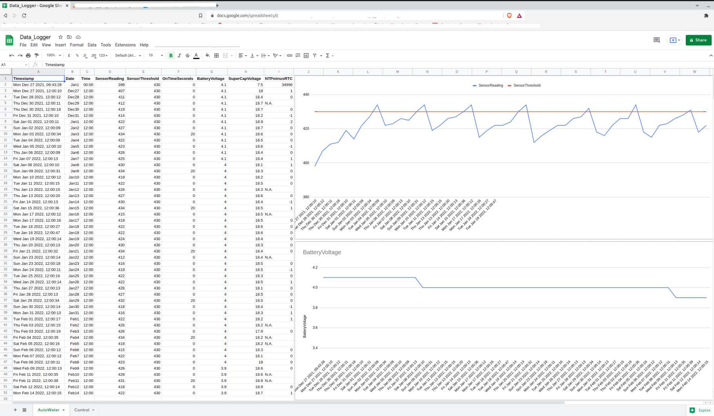
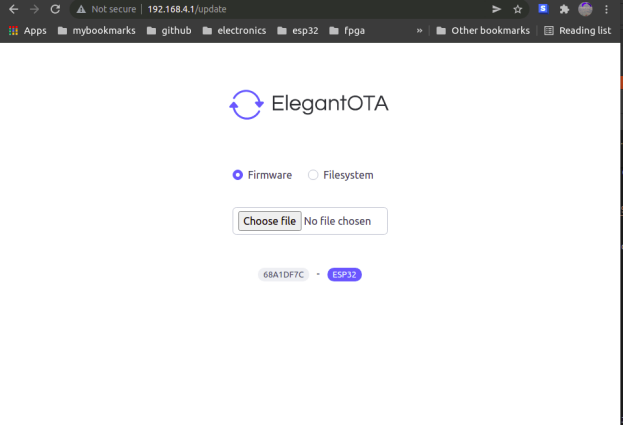

# ESP32_AUTO_WATER

An ESP32 module together with a capacitive soil moisture sensor and DS3231 Real-time Clock (RTC) is used to automatically water a plant bed using a pump placed in a water storage container. 

Power for the pump comes from a bank of supercapacitors charged by a solar panel. The solar panel also charges a battery that supplies power to the electronics.

The system is self-contained. No mains power supply or connection to a water faucet is required.

In normal watering mode, the ESP32 is woken up from deep-sleep once a day at a scheduled time by the DS3231 RTC. It checks the soil moisture level and if required, turns on the water pump. 

It then optionally logs the calendar date and time, moisture sensor reading, power supply voltages, watering duration, RTC clock drift (compared to NTP time) as a row of entries in a Google Docs spreadsheet document. 

If Google Sheet uploading is enabled and the configured Internet Access Point is not available, the data record is queued to a buffer in ESP32 flash memory. When internet access is available, the records in flash are removed from the queue and uploaded before the current day's data record. Up to 30 records (30 days) can be queued in ESP32 flash. After 30 days, the oldest record will be over-written by the current day's data record.

 
 

To configure the watering system, press the reset button for the ESP32 module and then immediately press the configuration button (GPIO0) when you hear a pulsing tone. Keep it pressed until you hear a long confirmation tone, and then release. The system is now configured as a stand-alone WiFi Access Point (AP) with SSID `ESP32Timer` and password `123456789`.

A web server running on this AP at `url : http://192.168.4.1` can then be used to configure the following :
* System Options
  * Enable / disable uploading of data to the Google Docs spreadsheet
  * Google Sheet URL ID
  * Google Sheet tab name
  * Internet Access Point SSID 
  * Internet Access Point password
  * Local Time Zone offset from UTC
  * Local Daylight Savings offset
  * Daily wake-up time
  * Soil moisture threshold for watering
  * Pump on-time
* Real-Time Clock
  * Date
  * Time

Note that the RTC configuration is useful for initial setting. If Google Sheet update is enabled and
internet access is available, the system will get the local time from a Network Time Protocol (NTP) server and correct the RTC if required.  The error in seconds (NTP time minus RTC time) is also logged to the Google Sheet.

When done with web page configuration changes, press the reset button on the ESP32 module for normal watering mode with the new configuration.

 
 

The watering system may not be conveniently located for cable-based programming. So you can also update the firmware via this configuration server page.  After the new firmware binary file is uploaded, the ESP32 will automatically re-start with the updated firmware.

 
 

# Execution log and current draw

 
The sensor was disconnected for this run : "Sensor reading  0". 

When

* Google Sheet update is enabled
* Internet access is available
* Watering is not required
* No queued unsent records

the total time each day not in deep-sleep mode is ~15 seconds. This includes time spent to get local time from an NTP server and check against RTC time.

If watering is required, an additional 20 seconds assuming the default pump on-time of 20 seconds. 

Note that Google Sheets returns a redirect HTTP code (302), so this is the expected value.

The current drawn from an 18650 Li-Ion battery was monitored by an external INA219 current sensor
based meter, gated by a gpio signal from the ESP32 (set to 1 on boot, reset to 0 just before entering deep-sleep). The meter samples the current at 1.14kHz (17664 samples in 15.507seconds). 

The current measurements are consistent : 
1. In active mode (from reset to entering deep-sleep) the average system current drain from the battery is ~47mA, with peaks of 400+mA corresponding to wifi transmission bursts. This includes the ~6mA current drain due to the moisture sensor.
2. When the ESP32 is in deep-sleep mode (with power to the moisture sensor switched off), the total system current drain is ~20uA. 

# Build Environment
* Ubuntu 20.04 LTS amdx64
* Visual Studio Code with PlatformIO plugin using Arduino framework targeting `esp32dev` board. The file `platformio.ini` specifies the framework packages and libraries used by the project.
* Custom `partition.csv` file with two 1.9MB code partitions supporting OTA firmware update
* ~160kByte SPIFFS partition for hosting HTML web server pages

# Hardware 
## Power supply

* Solar panel 
A 20V solar panel is used to charge up a bank of supercapacitors. This is used to power the 12V 
water pump, as it may not be sunny enough to run the pump directly off the solar panel when the 
ESP32 wakes up at the scheduled time.

* Li-ion Battery 18650 
This is used to provide power for the ESP32 module via a 3.3V regulator. 

* Supercapacitor bank 
I used eight 10F 2.7V supercapacitors in series to provide an energy storage bank to power the 12V water pump. 
Even on a moderately cloudy day, the capacitor bank slowly charges up to ~18V. 
I used a series 1N4007 diode from the solar panel so that the capacitor bank does not discharge back through the panel. Once charged, the supercap bank can run the 12V water pump for 30+ seconds.

## DS3231 RTC 
This provides a daily alarm at the scheduled time to wake up the ESP32 from deep sleep.

### Minimizing DS3231 current drain
When the DS3231 VCC pin is connected to the HT7333 3.3V output, and an external CR2032 coin cell is connected to the VBAT pin providing backup, the RTC drains < 100uA as per the datasheet. I measured ~110uA total circuit current drain in deep-sleep mode. The bulk of the deep-sleep circuit current drain is from the RTC.
    
However, the datsheet gives us a useful option : leave the DS3231 VCC pin disconnected and power the VBAT pin with the regulator 3.3V output. The RTC SCL, SDA and INT_/SQW pins are now pulled up via resistors to the VBAT pin. In this case, the RTC time-keeping operation works as before but with much less current drain. I measured ~20uA total circuit drain in deep-sleep mode. 
    
There are a couple of caveats : 
1. it takes a couple of seconds for the oscillator to start up the first time power is applied to VBAT
2. If you disconnect the battery, there is no backup so the RTC loses all date/time information. This is not an issue if we enable google sheet update - when the ESP32 connects to the internet, it updates the RTC with NTP server time. 
    
If we disable google sheets update, we can still configure the RTC date/time via WiFi web page access - a minor inconvenience of needing to do this each time we disconnect and reconnect the battery.

### RTC reset pulse
A 4.7uF capacitor in series between the DS3231 INT/SQW output pin and the ESP32 EN pin generates a ESP32 reset pulse at the daily scheduled time.

For the ESP32 EN pin, I used a 2K2 resistor pullup to VCC and a 1uF ceramic cap to ground. This is enough to avoid (known) ESP32 reset issues, while allowing the DS3231 reset pulse to work reliably.

## Capacitive soil moisture sensor

[Ensure you have a capacitive sensor module that actually works!](https://www.youtube.com/watch?v=IGP38bz-K48) The version I have uses a 555 timer IC marked "NE555 20M". 

I sealed the electronics back-end of the sensor board with silicone caulk and a heatshrink tube to prevent any corrosion of the electronics. A 1-meter shielded cable provides ground, 3.3V and sensor output interface to the ESP32.

It is possible for the top soil layer to dry out while the roots are still in damp soil. So the sensor is placed horizontally, halfway down the side of the plant pot. 

This particular sensor has a current draw of ~6mA.  It is powered via a nmos-pmos fet (2N7002/PMV65XP) power switch circuit  controlled via ESP32 GPIO pin 25. After reading the sensor, the power is switched off. This is critical for minimizing total circuit current draw during the ESP32 deep-sleep cycle.

## Power Mosfet module

I used this mosfet transistor module to control the water pump. The PWM input is connected to an ESP32 GPIO pin for simple on-off control. 

The supercapacitor power bank (max voltage < 19V) provides the DC power supply for the 12V water pump. I used an FR303 diode as flyback protection for the inductive motor load.

## Minimizing circuit current drain

The goal is to use a primary battery or a rechargeable battery with low self-discharge without needing to replace the battery or recharge it for a few months at least. E.g. 4 alkaline 1.5V AA batteries in series. Or 4 Eneloop 1.25V rechargeable batteries in series (they have very low self-discharge rates).

I used a Holtek HT7333 3.3V regulator because it draws very little quiescent current (~4uA) and has
a low dropout voltage of 100mV. 

The ESP32 is clocked at the minimum clock frequency (80MHz) that gives us WiFi capability.

The capacitive moisture sensor draws ~6mA but is switched off after the reading is taken. 

In deep-sleep mode, the circuits drawing current are :
    * ESP32 deep-sleep current (typical 10uA)
    * HT7333 regulator quiescent current (typical 4uA)
    * The resistor drop providing the sensed battery voltage to the ESP32 ADC. I used a 500K potentiometer to minimize the current draw, with a 100nF capacitor on the ADC pin to minimize noise due to the high source impedance.
    * DS3231 RTC 

We can estimate battery capacity drain over the course of a day : 
1. ~50mA x ~20 seconds for active time = 50mA x (20/3600)Hr = 0.28mAHr
2. ~20uA x ~24 hours in deep-sleep mode = 0.02mA x 24Hr = 0.48mAHr
So the total capacity drain in 24 hours = 0.28 + 0.48 = 0.76mAHr

# Credits
* [Updating Google Sheet via HTTPS](https://stackoverflow.com/questions/69685813/problem-esp32-send-data-to-google-sheet-through-google-app-script)
* [ESP32 Async Web Server using SPIFFS]( https://randomnerdtutorials.com/esp32-web-server-spiffs-spi-flash-file-system/)
* [ESP32 File Upload](https://github.com/smford/esp32-asyncwebserver-fileupload-example)