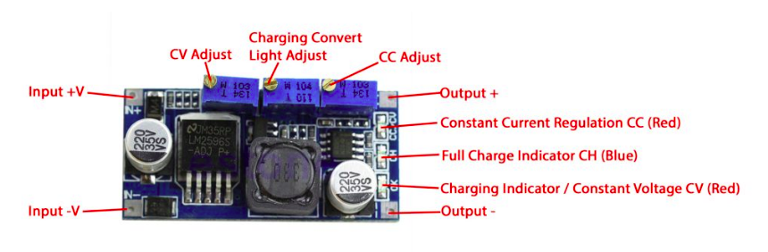

# ESP32_AUTO_WATER

An ESP32 module together with a capacitive soil moisture sensor and DS3231 Real-time Clock (RTC) is used to automatically water a plant bed using a pump placed in a water storage container. 

Power for the pump comes from a bank of supercapacitors charged by a solar panel. The solar panel also charges a battery that supplies power to the electronics.

The system is self-contained. No mains power supply or connection to a water faucet is required.

In normal watering mode, the ESP32 is woken up from deep-sleep once a day at a scheduled time by the DS3231 RTC. It checks the soil moisture level and if required, turns on the water pump. 

It then optionally logs the calendar date and time, moisture sensor reading, power supply voltages and watering duration as entries in a Google Docs spreadsheet document. 

If you want to configure the watering systems, press the reset button for the ESP32 module and then press the configuration button (GPIO0) when you hear a series of short beeps. Keep it pressed until you hear a long confirmation tone, and then release. The system is now configured as a standalone WiFi Access Point (AP) with SSID `ESP32Timer` and password `123456789`.

A web server running on this AP at `url : http://192.168.4.1` can then be used to configure the following :
* Schedule
  * Daily wake-up time
  * Soil moisture threshold for watering
  * Pump on-time
* Real-Time Clock
  * Date
  * Time
* Google Sheet update
  * Enable / Disable update
  * AP SSID and password for internet access

When done with changes, reset the ESP32 for normal watering mode with the new configuration.

You can also update the firmware via this WiFi AP, as the watering system may not be conveniently located for serial port cable-based programming. After the new firmware binary file is uploaded, the ESP32 will automatically re-start with the updated firmware.

# Build Environment
* Ubuntu 20.04 LTS amdx64
* Visual Studio Code with PlatformIO plugin using Arduino framework targeting `esp32dev` board. The file `platformio.ini` specifies the framework packages and libraries used by the project.
* Custom `partition.csv` file with two 1.9MB code partitions supporting OTA firmware update
* ~160kByte SPIFFS partition for hosting HTML web server pages

# Hardware 
## Power supply

* Solar panel 
A 20V solar panel is used to charge a 6V lead acid battery via a CC-CV module. It is also used to charge up a bank of supercapacitors, as it may not be sunny enough to run the 12V water pump directly off the solar panel.

* Lead acid battery 6V 1.3Ah 
This is used to provide power for the ESP32 module via a 3.3V regulator. You could instead use a 3.7V li-ion battery with a Li-ion MPPT solar charger module. 
I used an HT7333 LDO 3.3V regulator because it draws very little quiescent current (< 5uA) and can handle higher input voltages.  
When the ESP32 module is active the current draw is approximately 25mA on average.  
When the ESP32 module is in deep sleep, the additional circuits drawing current are :
    * HT7333 regulator quiescent current (< 5uA)
    * DS3231 RTC (< 100uA)
    * The resistors providing the sensed voltages to the ESP32 ADC. I used 500K potentiometers to minimize the current draw, with a 100nF capacitor on the ADC pins to minimize noise due to the high source impedance.

* Supercapacitor bank 
I used eight 10F 2.7V supercapacitors in series to provide an energy storage bank to power the 12V water pump. 
Even on a moderately cloudy day, the capacitor bank slowly charges up to ~18V. 
I used a series 1N4007 diode from the solar panel so that the capacitor bank does not discharge back through the panel or the CC-CV module. Once charged, there's enough juice in the supercap bank to run the 12V water pump for 30+ seconds.

## DS3231 RTC 
This provides a daily alarm at the scheduled time to wake up the ESP32 from deep sleep. A 4.7uF capacitor in series between the DS3231 INT/SQW output pin and the ESP32 EN pin generates a reset pulse for ESP32 wake-up.

For the ESP32 EN pin, I used a 2K2 resistor pullup to VCC and a 1uF ceramic cap to ground. This is enough to avoid (known) ESP32 reset issues, while allowing the DS3231 reset pulse to work.

A CR2032 3V coin cell battery provides VBAT backup for the DS3231 RTC. 

## Capacitive soil moisture sensor

[Ensure you have a capacitive sensor module that actually works!](https://www.youtube.com/watch?v=IGP38bz-K48) The version I have uses a 555 timer IC marked "NE555 20M". 

I sealed the electronics back-end of the sensor board with silicone caulk and a heatshrink tube to prevent any corrosion of the electronics. A 1-meter shielded cable provides ground, 3.3V and sensor output interface to the ESP32.

It is possible for the top soil layer to dry out while the roots are still in damp soil. So the sensor is placed horizontally, halfway down the side of the plant pot. 

## CC CV battery charger module

I used an LM2596 module to charge the 6V 1.3Ah lead acid battery. I set open circuit voltage (CV) to 7.2V, and short-circuit current (CC) to 0.25A.

## Power Mosfet module

I used this mosfet transistor module to control the water pump. The PWM input is connected to an ESP32 GPIO pin for simple on-off control. 

The supercapacitor power bank (max voltage < 19V) provides the DC power supply for the 12V water pump. I used an FR303 diode as flyback protection for the inductive motor load.

# Credits
* [Updating Google Sheet via HTTPS](https://stackoverflow.com/questions/69685813/problem-esp32-send-data-to-google-sheet-through-google-app-script)
* [ESP32 Async Web Server using SPIFFS]( https://randomnerdtutorials.com/esp32-web-server-spiffs-spi-flash-file-system/)
* [ESP32 File Upload](https://github.com/smford/esp32-asyncwebserver-fileupload-example)